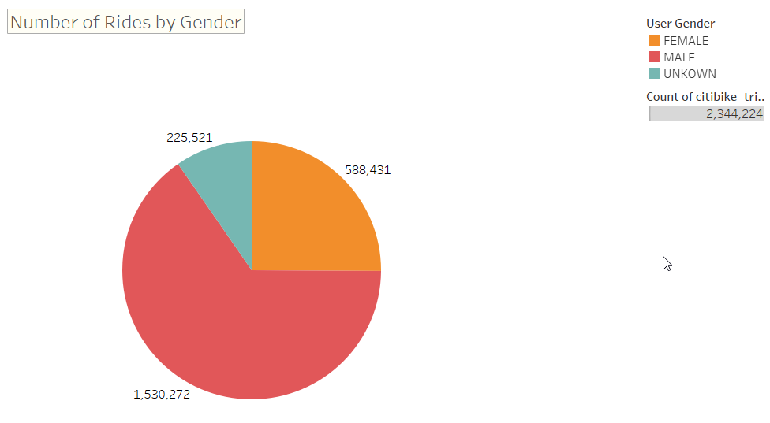
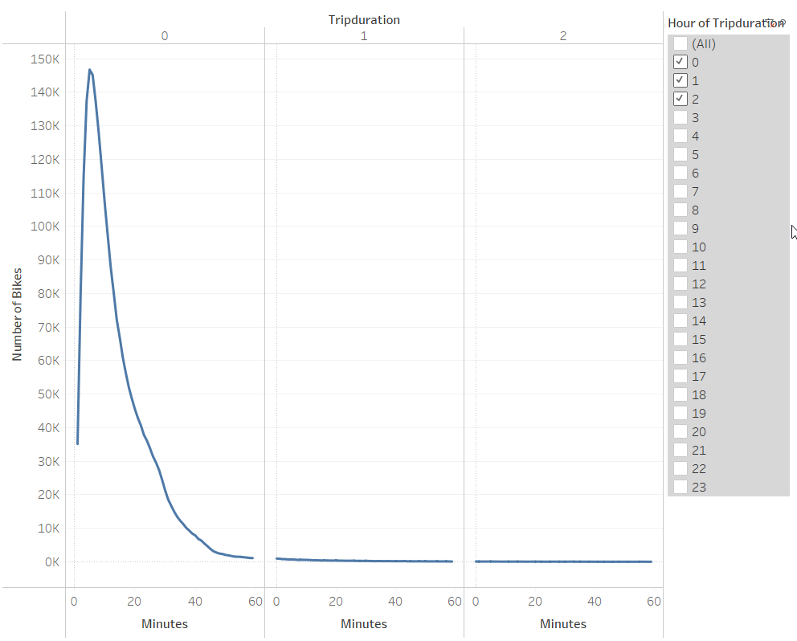
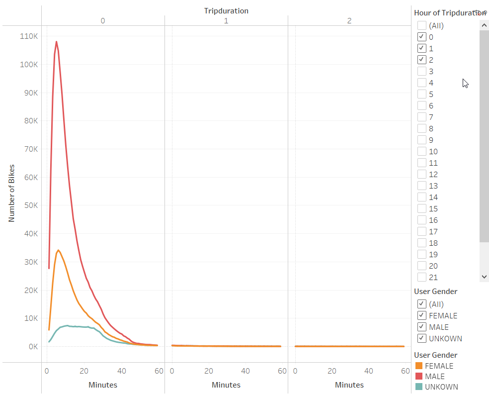
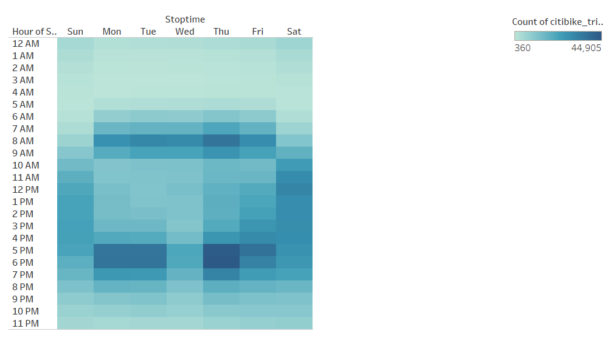
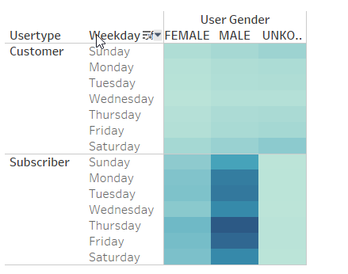
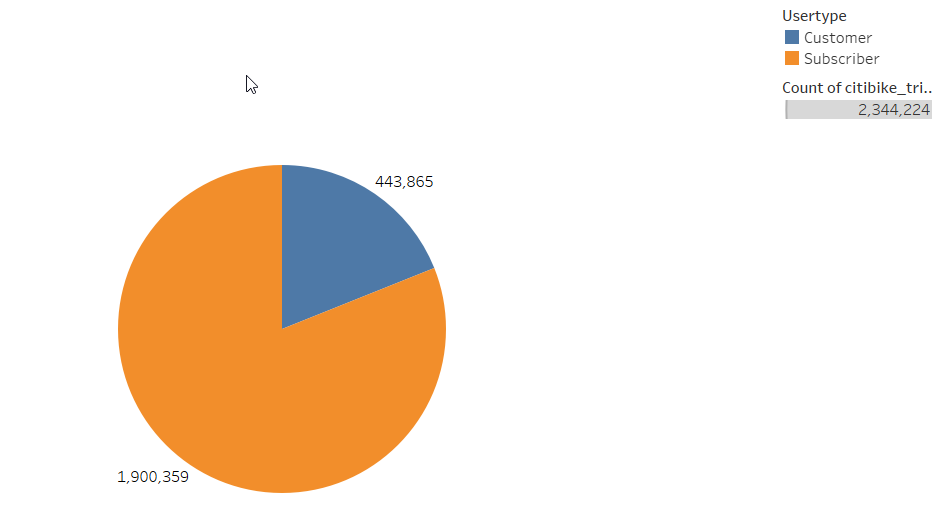

# NYC Citi Bike Analysis

## Overview

Use data from the Citi Bike program in New York City to create various data visualizations to figure out how the bikeshare business works in NYC. And use this information to create a proposal for an investor by exploring how it might work in des moines. 

### Purpose
The purpose of this analysis is to create the following data visualizations using Tableau:
- Length of time that bikes are checked out for all riders and genders
- The number of bike trips for all riders and genders for each hour of each day of the week
- The number of bike trips for each type of user and gender for each day of the week.

## Analysis

Data Source: From the Website: [Citi Bike NYC System Data](https://www.citibikenyc.com/system-data) - [Data for August 2019 from this list](https://s3.amazonaws.com/tripdata/index.html)

Software used: Python, Pandas, Jupyter Notebooks, Tableau 

#### Analysis Code: 
- [Datatype Correction using Pandas in Jupyter Notebooks](NYC_Citibike_Challenge.ipynb)
- [Data Visualizations on Tableau Public](https://public.tableau.com/profile/nehabhole#!/vizhome/NYCCitiBikeStoryChallenge/NYCCitiBikeStory)

## Results
Screenshots of the visualizations are listed below with descriptions.

### Gender Breakdown

As evident from the above pie chart, males are the highest (about 65 %) users of the citibike service. Followed by females at roughly 25% and unknown gender roughly 9%. 

### Checkout Times by User

Overall, most (roughly 145k) bikes are checked out for about 10 mins. The range for check out times lies somewhere between minimum of 0 mins to maximum of a little more than an hour. 

### Checkout Times by Gender

Since the the males are 65% of the bikeshare users, the graph for males is similar to the users with most bikes (roughly 108k) checked out for roughly 10 mins. The females checked out most bikes (roughly 35k) for roughly 8-10 mins. The remaining users with unknown gender have checked out about 5 k bikes for 5 to 30 minutes. 

### Trips by Weekday Per Hour

Overall, the peak hours for weekdays are during typical commute times. 

### Trips by Weekday Per Hour by Gender

This graph can be filtered for genders using the filters found on the right. 

### Trips by Weekday by Gender

The above graph shows the gender breakdown for casual renters and subscribers. As observed in the graph, most subscribers are male. 

### Customer Type Breakdown

This pie chart shows the overall breakdown of subscribers versus casual customers. As shown in the chart, roughly 80% of the customers are subscribers. 

## Summary

To summarize:
- Significantly more people use the bikeshare use the service on the weekdays than weekends.
- The subscribers outnumber the non subscribers by roughly 4 times. 
- When analyzing gender, male customers significantly outnumber female customer. 

### Two additional visualizations for future analysis

- Tourist places versus commercial areas. 

- Seasonal trends

